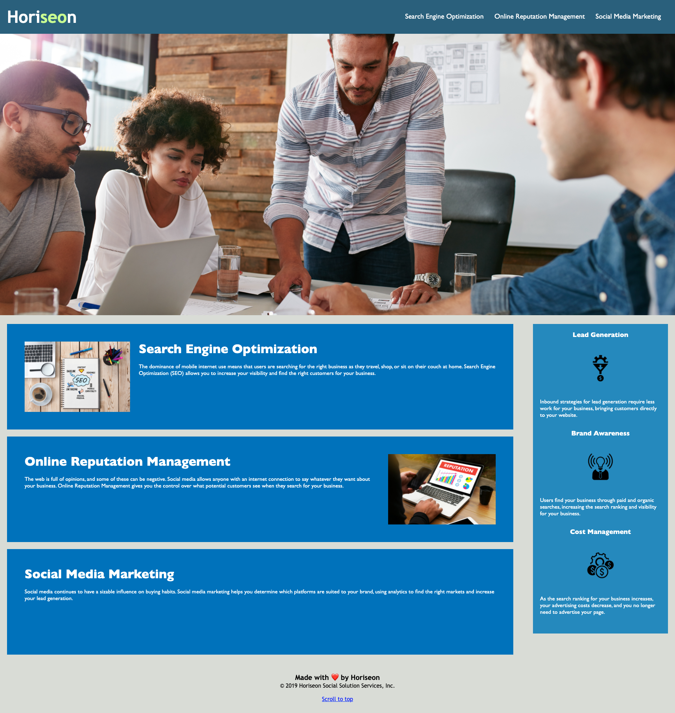

# horiseon-refactor
## Description
The Horiseon client asked for their website's html and css code to be refactored for readability, sustainability, and accessibility while still visually remaining the same.

## User Story

```
As a marketing agency, I want a codebase that follows accessibility standards so that our own site is optimized for search engines.
```

## Deployed web page visual



## Features
The following features were either previously present, fixed during refactor, or added during refactor:
* Nav bar buttons fixed to properly go to clicked section.
* Page scrolls smoothly across page instead of jumping to the section.
* Horiseon text in nav bar is now a link that moves the page view to the top of the page.
* Added link in footer to also move the page view to the top of the page.
* Hero image was given an alt value for accessibility.

## Deployed Link
https://andrewbyoo.github.io/horiseon-refactor/

## License
[](./LICENSE)
